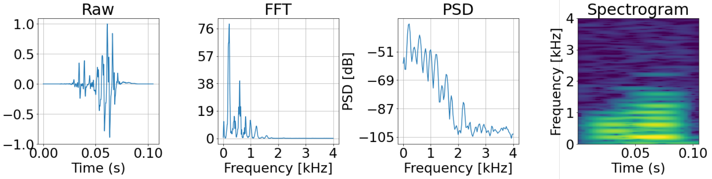

# Hierarchical Classification of Insect Species Using Wingbeat Signals

## Table of contents

* [Introduction](#introduction)
* [Input Formats](#input-formats)
* [Classifiers](#classifiers)
* [Tutorial](#tutorial)

## Introduction

There are currently around 33,000 different insect species reported to have their habitat across Germany. However, [recent studies](https://journals.plos.org/plosone/article?id=10.1371/journal.pone.0185809) have revealed that over the past 27 years the insect biomass in German nature protected areas has decreased by 75%. The research project *KInsekt* at the the Beuth University of Applied Sciences in Berlin is part of the [common effort](https://www.z-u-g.org/aufgaben/ki-leuchttuerme/projektuebersicht-fl2/kinsekt/) to monitor the population of insects in Germany and better understand its variety.

This repository accompanies [Teodor Chiaburu's Master's thesis](Master_Thesis.pdf) *Hierarchical Classification of Insect Species Using Wingbeat Signals*. It contains all the libraries and notebooks written in Python with Tensorflow, Keras and Sklearn used to build the pipeline for classifying insects with Deep Learning. The experiments presented in the thesis were carried out on two well-known datasets from the literature ([Keogh dataset](https://timeseriesclassification.com/description.php?Dataset=InsectWingbeat) and [Potatamis dataset](https://www.kaggle.com/potamitis/wingbeats)) and only the two lowest taxonomic levels were considered (species and genus). Nevertheless, the software created here is flexible and can be applied to an indefinite number of species. The modular structure of the models allows them to be easily combined with one another and be extended to include more taxonomic levels as well. All the classifiers can also run efficiently on a Raspberry Pi 4 and achieve accuracy scores comparable to the benchmarks in the literature ([paper 1](http://www.ee.columbia.edu/~dpwe/pubs/SilvaSBKE13-insect.pdf) and [paper 2](https://www.researchgate.net/publication/241635781_Towards_Automatic_Classification_on_Flying_Insects_Using_Inexpensive_Sensors) for Keogh et al., [paper 3](https://www.eurasip.org/Proceedings/Eusipco/Eusipco2018/papers/1570439278.pdf) for Potatamis et al.).

## Input Formats

Based on the recorded wingbeat signal, two alternative input transformations were considered for training the models: **Power Spectral Density (PSD)** obtained through the *Welch-Transform* and **Spectrograms** computed with the *Short Time Fourier Transform*. However, the models can be reconfigured to accept any input shapes and types, so that feeding data in form of Fourier amplitudes, wavelets or Mel coefficients, for example, is also possible. Experiments on manipulating data can be found [here](notebooks/experiments).

## Classifiers

The main focus of the thesis was to investigate whether integrating hierarchical information into the model architecture would increase classification accuracy. This was implemented via **Hierarchy-based Class Embeddings (HCEs)** (paper [here](https://arxiv.org/abs/1809.09924)). The ensuing network designs are depicted as graphs [here](figures/architectures). For illustration purposes, only the PSD classifiers are presented. The input shape is (129, 1) according to the length of a PSD vector. The **CNN_1D** is a custom-made series of 5 convolutional blocks (see [*layers.py*](wingbeats/modelling/layers.py)) and can be easily swaped with any other feature extractor i.e. MobileNet. The output shapes correspond to the number of species (9) and genera (4). *Hierarchical* models differ from *Simple* models in that they have an extra branch responsible for predicting the HCEs. It turned out that while adding hierarchical embedders did not improve the accuracy scores on the test set (see results on Raspberry Pi [here](figures/raspberry)), models that learnt to predict HCEs along with class probabilities were more robust in that they would more consistently identify the relevant wingbeat patterns (see [Saliency Maps](figures/maps), [Pixel Flipping](figures/pixel_flip) and [Adversarial Attacks](figures/adversarial)). For details on how the XAI results were produced and how to interpret them read the XAI section in the Master's thesis.

## Tutorial

1. **Data Cleaning** (see [*preprocessing.py*](wingbeats/processing/preprocessing.py))
    - Normalization

    Signals need to be on the same scale since insects that fly closer to the sensor appear to be louder. Beware of the differences between the standard methods for loading signals: `scipy.io.wavfile.read()` loads the amplitudes as *int16*-points, while `librosa.load()` converts them into *float*-points by dividing them by the highest possible value in the data type range (216-1 for *int16*).

    - Cropping

    Make sure that all signals are equally long. In case they are not, you need to crop them (for instance around the frame with the highest Root Mean Square)

    - Denoising

    You may consider applying low-pass filters i.e. Butterworth to reduce the background noise. However, this could cause watermarks in the filtered signals that may distract the classifier. Consider using *spectral subtraction* when the background noise is known.

    - Outlier Removal

    Some samples may be wrongly cropped or the sensor recorded an event that had nothing to do with the flight of an insect. One possible approach is to apply a Fourier detector to inspect suspicious coefficients in the Fourier spectrum (wingbeat frequencies usually lie between 100 and 1000 Hz).

2. **Data Preprocessing** (see [*preprocessing.py*](wingbeats/processing/preprocessing.py))

    - Data Splitting

    See notebooks in [**utils**](notebooks/utils) for data splitting examples. 
    
    **Warning!** We left out 2 species from the Keogh dataset in the initial training process. They were added later to test the generalization power of our models. When using `train_test_split` from Sklearn, the splits will be different, when new classes are added, even if the random seed is fixed. Follow the guidelines in the notebooks linked above.

    - Input Format Conversion

    Transform raw amplitudes into other objects i.e. PSD vectors or 2D spectrograms. When the dataset is large and the transformation more complex, it is advisable to first convert the data matrix into a *Tensorflow Dataset* to speed up operations on the samples.

    - Data Augmentation

    For imbalanced datasets, applying some sort of data augmentation is worth considering. In the thesis, **Synthetic Minority Oversampling Technique (SMOTE)** was used ([paper](https://arxiv.org/pdf/1106.1813) and [code](https://github.com/scikit-learn-contrib/imbalanced-learn)). You may want to fine-tune your augmentation hyperparameters as well.

    - Hierarchical Embeddings

    To integrate the hierarchical structure of the insects taxonomy into the learning process, the label vectors are represented not as one-hot encodings but as HCEs. Models also need to be extended such that they learn to predict approximations of these HCEs.

3. **Inference**

    - Load Models (Transfer Learning)

    All trained models can be found under the directory [**models**](models). Their weights can be downloaded and used as such or loaded as initializations for new classifiers created with the methods from [*builds.py*](wingbeats/modelling/builds.py). The *tflite* files are the models converted to run on Raspberry Pi (test scripts [here](scripts)). Examples of applying models for Transfer Learning can be seen in these [notebooks](notebooks/transfer_learning).

    In case you want to retrain your new models from scratch, you can follow the hypertuning pipeline presented in these [notebooks](notebooks/hypertuning). For the thesis, hyperparameter tuning was done using **Hyperband** ([paper](https://arxiv.org/abs/1603.06560)) and **k-fold Cross Validation**. 

4. **XAI**

    The [*xai.py*](wingbeats/xai/xai.py) library offers some methods to understand how the models make their decisions. For more tools visit the [**innvestigate library**](https://github.com/albermax/innvestigate). Note that our XAI module imports some functions from this repository, so make sure to clone it and set it on the same directory level as the **wingbeats** package. In the directory [**validation**](notebooks/validation) you can find examples of how to apply these XAI methods.
